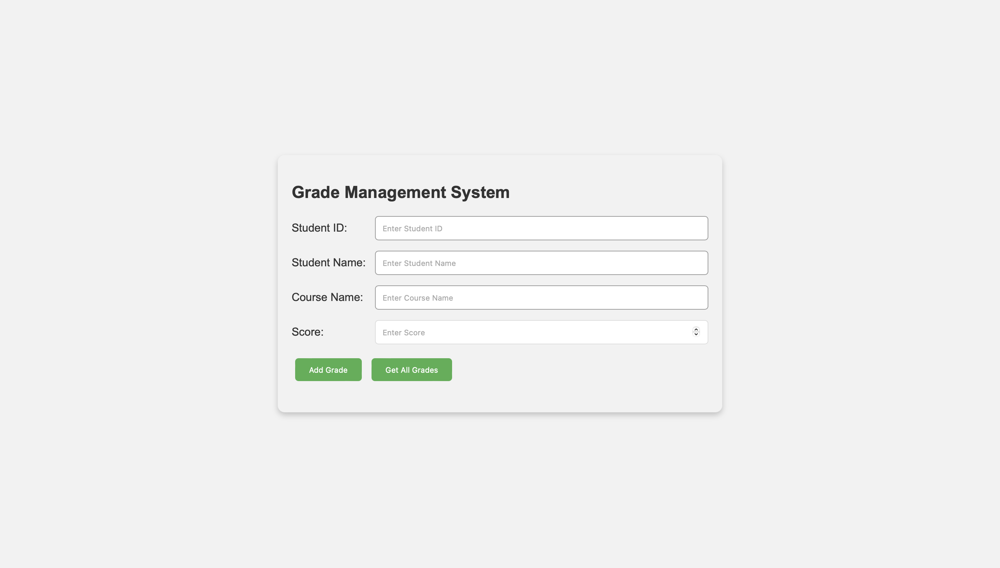
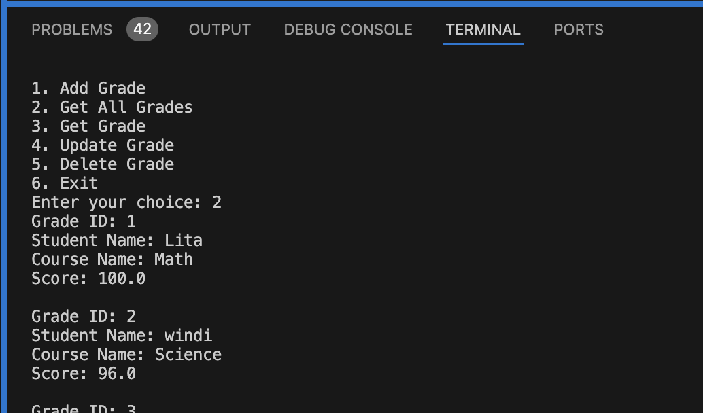
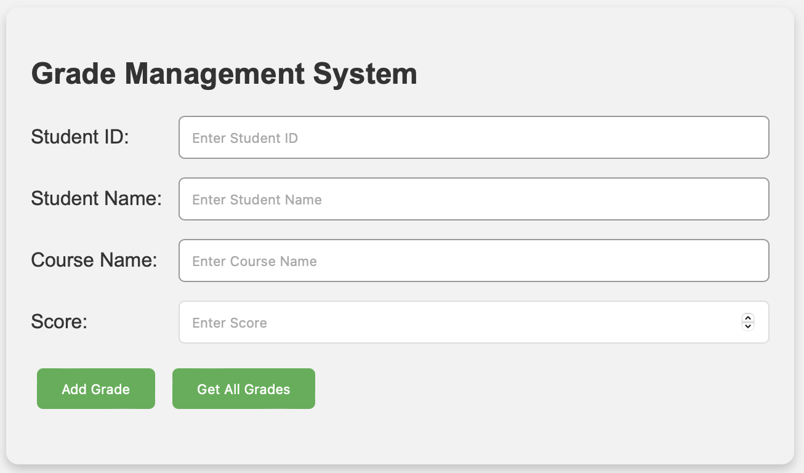
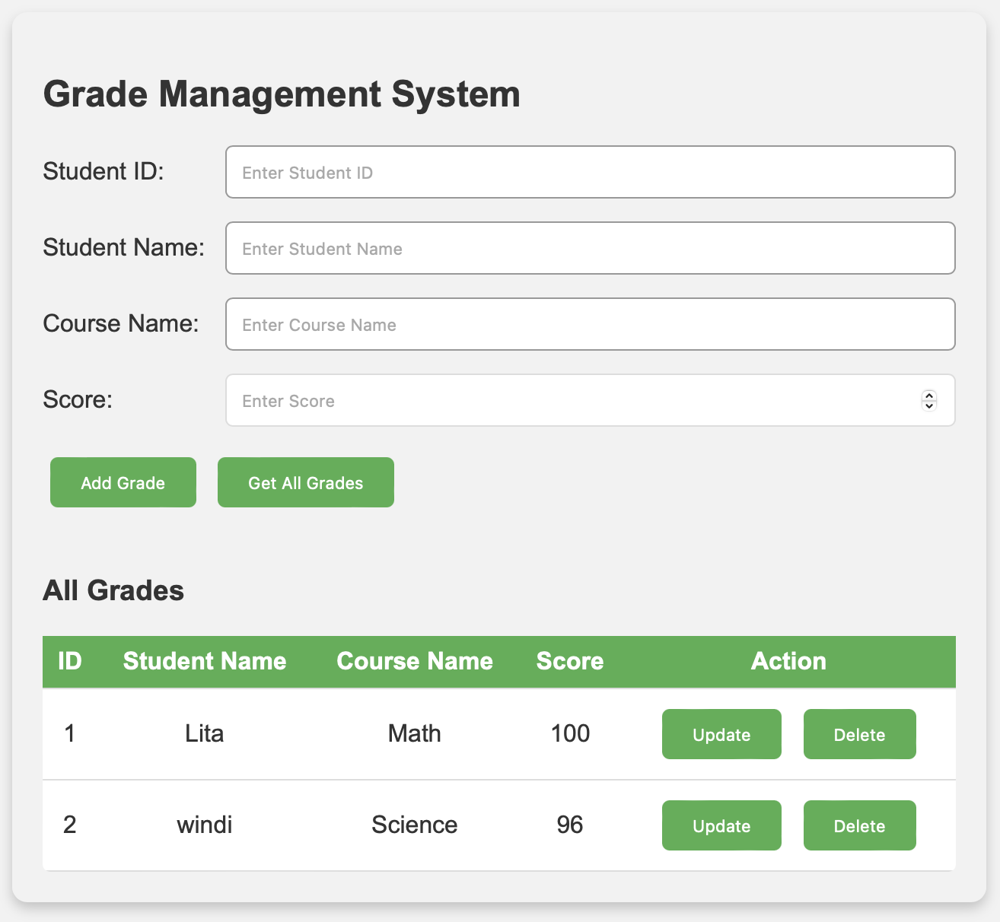
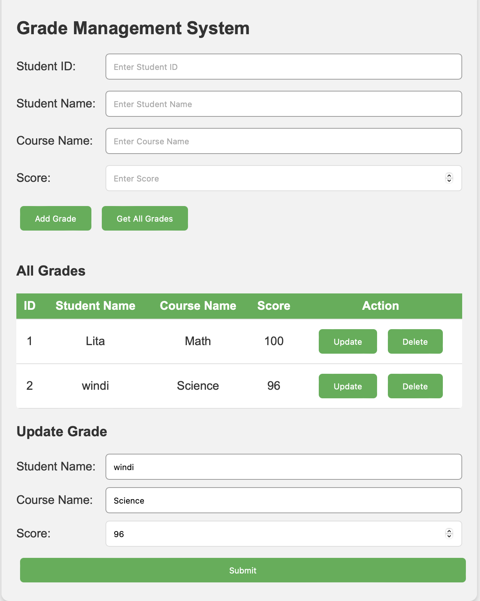
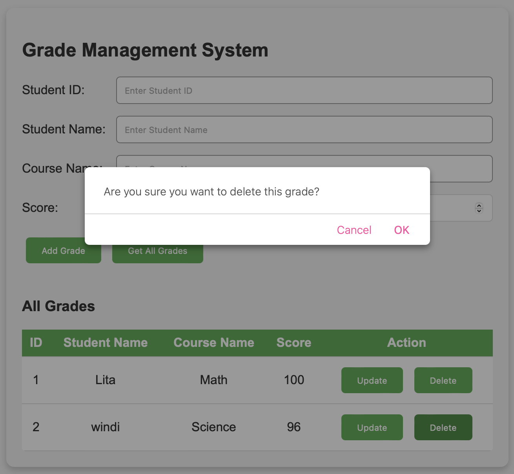
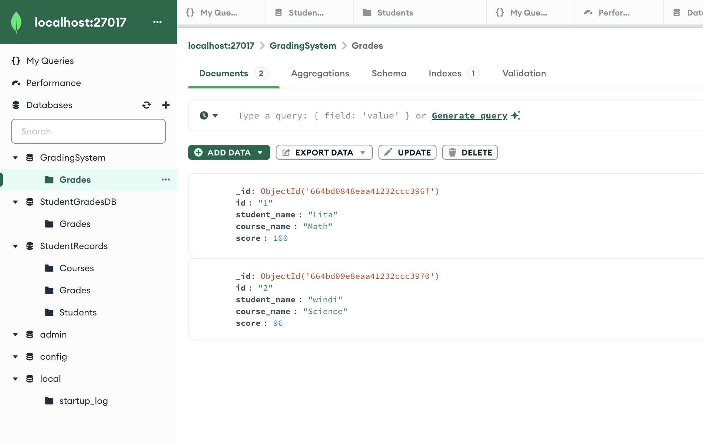
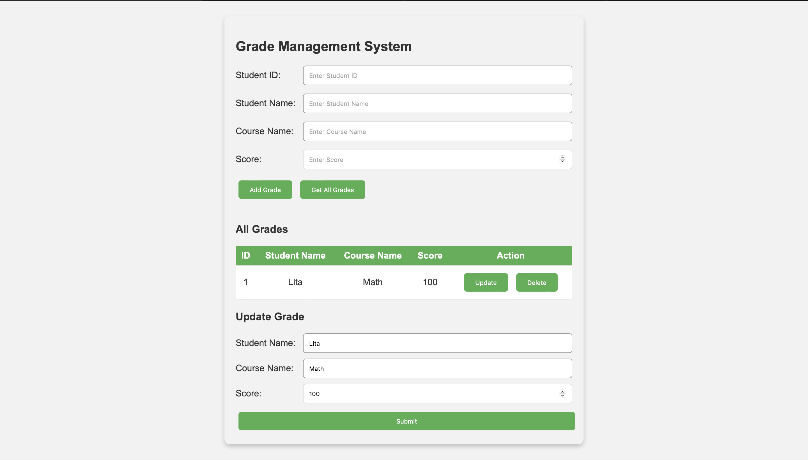

# UTS Integrasi Sistem 2024

## Implementasi gRPC API dan Protobuf

**Khansa Adia Rahma**  
**5027221071**



### Introduction
This project showcases the implementation of a Grade Management System using gRPC API and Protobuf. gRPC (gRPC Remote Procedure Call) is a modern, high-performance framework for efficient communication between distributed systems, while Protobuf (Protocol Buffers) provides a language-agnostic and efficient mechanism for serializing structured data.


### Step-by-Step Guide

1. **Proto File Creation**: Begin by creating a proto file *grading.proto* to define the structure of the gRPC service and the messages exchanged between client and server. Compile the proto file using `grpcio-tools` to generate corresponding Python files (grading_pb2_grpc.py and grading_pb2.py).
```bash
    pip3 install Flask Flask-CORS grpcio grpcio-tools pymongo
    python3 -m grpc_tools.protoc -I. --python_out=. --grpc_python_out=. grading.proto
```

2. **Server Setup**: Develop a *server.py* file to establish a connection with a MongoDB database. The server handles incoming gRPC requests from clients and interacts with the database to perform CRUD operations on grade data.

```bash
    python3 server.py
```

3. **Client Implementation**: Create an *app.py* file to act as the client, connecting to the gRPC server and making requests for various grade management services. This client application interacts with the server to create, read, update, and delete grade records.

```bash
    python3 app.py
```

4. **Client Execution**: Execute the *client.py* file to demonstrate the functionality of the Grade Management System. Users can interact with the system by making requests through the client interface.

```bash
    python3 client.py
```


5. **Frontend Integration**: Finally, integrate the grade management services into a frontend interface using HTML, CSS, and JavaScript. This interface provides users with a user-friendly environment to perform CRUD operations on grade data.


### Key Features
1. **Create**: Users can create new grade records by providing student ID, name, course name, and score.
   

2. **Read**: The system allows users to retrieve and view all grade records by their unique IDs.
    
    
3. **Update**: Users can update existing grade records with new information, such as student name, course name, and score.
   

4. **Delete**: The system supports the deletion of grade records by their respective IDs.
    

5. **MongoDB Integration**: Seamless integration with a MongoDB database allows for persistent storage and retrieval of grade data.
    

6. **UI/UX Implementation**: The frontend interface is designed with a focus on user experience, featuring a clean layout and intuitive interactions.
    


